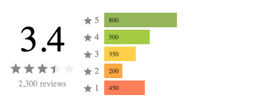

# React Star Rating Summary

<a  href="https://www.npmjs.com/package/@keyvaluesystems/react-star-rating-summary"></a>  <a  href="https://www.npmjs.com/package/@keyvaluesystems/react-star-rating-summary"  ></a>  <a  href="https://github.com/KeyValueSoftwareSystems/react-vertical-stepper"></a>

<div  align="center">
  
</div>

A ready to use star rating summary UI package on 5 star rating concept for React.

Try tweaking a rating summary component using this code sandbox link <a  href="https://codesandbox.io/s/vertical-stepper-demo-x24q7u"  >here</a>

## Installation

```bash
npm install @keyvaluesystems/react-star-rating-summary
```

You’ll need to install React separately since it isn't included in the package.

## Usage

React Star Rating Summary can be directly used in your project  by just providing the `ratings`  props like this:

```jsx
import React, { useState } from 'react';
import RatingSummary from '@keyvaluesystems/react-star-rating-summary';

function App() {
  const ratingsVal = {
    5: 100,
    4: 200,
    3: 300,
    2: 1000,
    1: 400
  };
  return (
    <RatingSummary
      ratings={ratingsVal}
    />
  );
};

export default App;
```
The `ratings` prop expects an object with star rating number as key (can be 1, 2, 3, 4 and 5) and count of the respective ratings as the value.

>Note: The total rating count will be calculated by the package and chart length for each rating will be considered with respect to total count. 

## Props

Props that can be passed to the component are listed below:

<table>
	<thead>
		<tr>
			<th>Prop</th>
			<th>Description</th>
			<th>Default</th>
		</tr>
	</thead>
	<tbody>
		<tr>
			<td><code><b>ratings:</b> object</code></td>
			<td>An object with ratingIds as key and respective count as value.</td>
			<td><code>undefined</code></td>
		</tr>
		<tr>
			<td><code><b>chartColors?:</b> object</code></td>
			<td>An object with ratingIds as key and respective chart color as value.</td>
			<td><code>undefined</code></td>
		</tr>
		<tr>
			<td><code><b>renderLabel?:</b> (ratingId: string): ReactElement</code></td>
			<td>A render function to customize your ratings label with your own element.</td>
			<td><code>undefined</code></td>
		</tr>
		<tr>
			<td><code><b>showCount?:</b> boolean</code></td>
			<td>Boolean to enable and disable showing count on the chart.</td>
			<td><code>true</code></td>
		</tr>
		<tr>
			<td><code><b>showAnimation?:</b> boolean</code></td>
			<td>Boolean to enable and disable showing animations and transitions on the chart.</td>
			<td><code>true</code></td>
		</tr>
		<tr>
			<td><code><b>styles?:</b> object</code></td>
			<td>Provides you with a bunch of style objects and callback functions to override the default styles.(refer 
			<a href="#style-customizations">Style Customizations</a>)
			<td><code>undefined</code></td>
		</tr>
		<tr>
			<td><code><b>onChartClick?:</b> (ratingId: string): void</code></td>
			<td>Click handler for each ratings chart</td>
			<td><code>undefined</code></td>
		</tr>
		<tr>
			<td><code><b>ratingRanks?:</b> object</code></td>
			<td>An object with ratingIds as key and their respective weightage in number as value, used to compute average of ratings.</td>
			<td><code>undefined</code></td>
		</tr>
		<tr>
			<td><code><b>showAverageRating?:</b> boolean</code></td>
			<td>Boolean to enable and disable showing average rating section.</td>
			<td><code>true</code></td>
		</tr>
		<tr>
			<td><code><b>customAverageFn?:</b> (ratings: object, ranks: object) => number</code></td>
			<td>A function that allows customization of the average computation for ratings, in order to override the default behavior.</td>
			<td><code>undefined</code></td>
		</tr>
		<tr>
			<td><code><b>averageRatingPrecision?:</b> number</code></td>
			<td>Determines the number of decimal places for displaying the average of ratings.</td>
			<td><code>1</code></td>
		</tr>
		<tr>
			<td><code><b>ratingAverageIconProps?:</b> object</code></td>
			<td>An object defining the fill color and background color for customizing the appearance of star icon in the average rating section.</td>
			<td><code>undefined</code></td>
		</tr>
		<tr>
			<td><code><b>thousandsSeparator?:</b> string</code></td>
			<td>A string specifying the custom thousands separator for formatting a numerical value.</td>
			<td><code>','</code></td>
		</tr>
		<tr>
			<td><code><b>ratingAverageSubText?:</b> string</code></td>
			<td>A string used to customize the text accompanying the star rating average which provides additional information about the total number of reviews.</td>
			<td><code>'reviews'</code></td>
		</tr>
	</tbody>
</table>

>Note: The numbers from 1 to 5 are the ideal values for `ratingIds`

<a name="style-customizations"></a>
## Style Customizations

Basic customization like changing the chart color for each ratings can be done using the `chartColors` prop:

```jsx
  <RatingSummary
    ratings={ratings}
    chartColors={{
      5: '#000',
      4: 'yellow',
      3: 'orange',
      2: 'blue',
      1: 'green'
    }}
  />
```
Further customizations can by done by overriding default styles using the `styles` prop,
the below code shows all the overridable styles:

```jsx
import React from 'react';
import RatingSummary from '@keyvaluesystems/react-star-rating-summary';

function App() {

  const ratings = {
		1: 100,
		2: 200,
		3: 300,
		4: 400,
		5: 500
	};

	const countColors = {
		1: 'red',
		2: 'yellow',
		3: 'blue',
		4: 'orange',
		5: 'white'
	};

  const stylesOverride = {
    Average: { color: 'purple' },
    AverageStarIcon: {
      width: '20px',
      height: '20px'
    },
    LabelStarIcon: () => ({
      width: '15px',
      height: '15px'
    }),
    Label: (ratingId) => ({ fontSize: '12px' }),
    Count: (ratingId) => ({color: countColors[ratingId]})
  };
  return (
    <RatingSummary
      ratings={ratings}
      styles={stylesOverride}
    />
  );
}

export default App;
```
- `Root` - overrides the style of outermost container.
- `SummaryContainer` - overrides the style of summary container.
- `AverageContainer` - overrides the style of average section.
- `Average` - overrides the style of average value.
- `AverageIconsWrapper` - overrides the style of icons container in the average section.
- `AverageStarIcon` - overrides the style of every individual star icon in the average section
- `AverageSubTextContainer` - overrides the style of sub-text container in the average section.
- `AverageTotalReviews` - overrides the style of total no. of review's value in the average section.
- `AverageSubText` - overrides the style of the sub-text adjacent to total no. of review in the average section.
  Label = 'Label',
  LabelStarIcon = 'LabelStarIcon'
- `Label` - overrides the Label container style for each rating.
- `LabelStarIcon` - overrides the style of the star icon in the label of each rating.
- `Chart` - overrides the Chart style for each rating.
- `Count` - overrides the rating count style for each rating.

>Note: if you provides both `chartColors` prop and overrides `Chart` styles using `styles` prop, the customizations via `styles` prop are given more priority.

Example with the usage other props
```jsx
import React from 'react';
import RatingSummary from '@keyvaluesystems/react-star-rating-summary';

function App() {

  const ratings = {
		1: 100,
		2: 200,
		3: 300,
		4: 400,
		5: 500
	};

	const countColors = {
		1: 'red',
		2: 'yellow',
		3: 'blue',
		4: 'orange',
		5: 'white'
	};

  const stylesOverride = {
    Average: { color: 'purple' },
    AverageStarIcon: {
      width: '20px',
      height: '20px'
    },
    LabelStarIcon: () => ({
      width: '15px',
      height: '15px'
    }),
    Label: (ratingId) => ({ fontSize: '12px' }),
    Count: (ratingId) => ({color: countColors[ratingId]})
  };
  return (
    <RatingSummary
      ratings={ratings}
      renderLabel={(ratingId) => ratingId}
			showAnimation={false}
			showCount={false}
			averageRatingPrecision={2}
			ratingAverageIconProps={{
				  fillColor: 'green',
          bgColor: 'red'
			}}
			ratingAverageSubText="total"
    />
  );
}

export default App;
```
