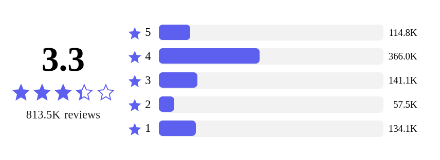

# React Star Rating Summary

<a  href="https://www.npmjs.com/package/@keyvaluesystems/react-star-rating-summary"></a>  <a  href="https://www.npmjs.com/package/@keyvaluesystems/react-star-rating-summary"  ></a>  <a  href="https://github.com/KeyValueSoftwareSystems/react-vertical-stepper"></a>

<div  align="center">
  
</div>

A ready to use star rating summary UI package on 5 star rating concept for React.

Try tweaking a rating summary component using this code sandbox link <a  href="https://codesandbox.io/s/vertical-stepper-demo-x24q7u"  >here</a>

## Installation

```bash
npm install @keyvaluesystems/react-star-rating-summary
```

You’ll need to install React separately since it isn't included in the package.

## Usage

React Star Rating Summary can be directly used in your project  by just providing the `ratings`  props like this:

```jsx
import React, { useState } from 'react';
import RatingSummary from '@keyvaluesystems/react-star-rating-summary';

function App() {
  const ratingsVal = {
    5: 100,
    4: 200,
    3: 300,
    2: 1000,
    1: 400
  };
  return (
    <RatingSummary
      ratings={ratingsVal}
    />
  );
};

export default App;
```
The `ratings` prop expects an object with star rating number as key (can be 1, 2, 3, 4 and 5) and count of the respective ratings as the value.

>Note: The total rating count will be calculated by the package and chart length for each rating will be considered with respect to total count. 

## Props

Props that can be passed to the component are listed below:

<table>
	<thead>
		<tr>
			<th>Prop</th>
			<th>Description</th>
			<th>Default</th>
		</tr>
	</thead>
	<tbody>
		<tr>
			<td><code><b>ratings:</b> object</code></td>
			<td>An object with ratingIds as key and respective count as value.</td>
			<td><code>undefined</code></td>
		</tr>
		<tr>
			<td><code><b>chartColors?:</b> object</code></td>
			<td>An object with ratingIds as key and respective chart color as value.</td>
			<td><code>undefined</code></td>
		</tr>
		<tr>
			<td><code><b>renderLabel?:</b> (ratingId: string): ReactElement</code></td>
			<td>A render function to customize your ratings label with your own element.</td>
			<td><code>undefined</code></td>
		</tr>
		<tr>
			<td><code><b>showCount?:</b> boolean</code></td>
			<td>Boolean to enable and disable showing count on the chart.</td>
			<td><code>true</code></td>
		</tr>
		<tr>
			<td><code><b>showAnimation?:</b> boolean</code></td>
			<td>Boolean to enable and disable showing animations and transitions on the chart.</td>
			<td><code>true</code></td>
		</tr>
		<tr>
			<td><code><b>styles?:</b> object</code></td>
			<td>Provides you with a bunch of callback functions to override the default styles.(refer 
			<a href="#style-customizations">Style Customizations</a>)
			<td><code>undefined</code></td>
		</tr>
		<tr>
			<td><code><b>onChartClick?:</b> (ratingId: string): void</code></td>
			<td>Click handler for each ratings chart</td>
			<td><code>undefined</code></td>
		</tr>
	</tbody>
</table>

>Note: The numbers from 1 to 5 are only taken as `ratingIds`

<a name="style-customizations"></a>
## Style Customizations

Basic customization like changing the chart color for each ratings can be done using the `chartColors` prop:

```jsx
  <RatingSummary
    ratings={ratingsVal}
    chartColors={{
      5: '#000',
      4: 'yellow',
      3: 'orange',
      2: 'blue',
      1: 'green'
    }}
  />
```
Further customizations can by done by overriding default styles using the `styles` prop,
the below code shows all the overridable styles:

```jsx
import React from 'react';
import RatingSummary from '@keyvaluesystems/react-star-rating-summary';

function App() {
  const stylesOverride = {
    Chart: (ratingId) => ({...styles}),
    Count: (ratingId) => ({...styles})
  };
  return (
    <RatingSummary
      ratings={ratingsVal}
      styles={stylesOverride}
    />
  );
}

export default App;
```
- `Chart` - overrides the Chart style for each rating.
- `Count` - overrides the rating count style for each rating.

>Note: if you provides both `chartColors` prop and overrides `Chart` styles using `styles` prop, the customizations via `styles` prop are given more priority.


